# Breast Cancer Tumor Classification
## Overview

1. This project uses Machine Learning Techniques to classify tumors as either Malignant or Benign with 97% accuracy.
2. This technique can rapidly evaluate breast masses and classify them in automated fashion.
3. I used a dataset from UCI which had 569 instances of tumors: https://archive.ics.uci.edu/ml/datasets/Breast+Cancer+Wisconsin+%28Diagnostic%29
4. The missclassification in this case study was of a Type 1 Error. In other words, 3 tumors were classified as Malignant when they were Benign.
5. There were no Type 2 Errors, which are far more dangerous. This would mean tumors would be classified as Benign while they are Malignant.
6. The technique can reduce workload for doctors and save lives, especially in the developing world.
7. The technique can be further improved by combining Computer vision/ML techniques to directly classify cancer using the tissue image.

## Procedure

I imported the Breast Cancer Dataset from UCI archive and sorted the traget_names (i.e. malignant vs. benign) and the 30 key features of a tumor. I transferred this data into a data frame that I would be using for the study. 

Afterwards, I visualized the data using multiple methods from seaborn library such as pairplot and heatmaps.These helped me decide which key features I would use to conduct my experiment, I decided to choose mean smoothness and mean area.
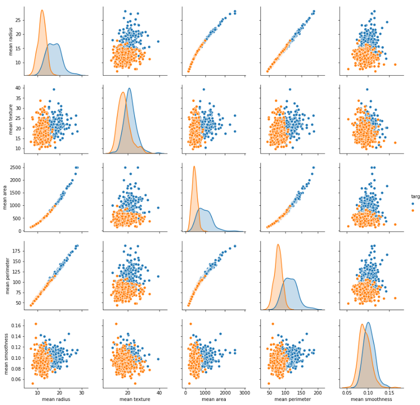
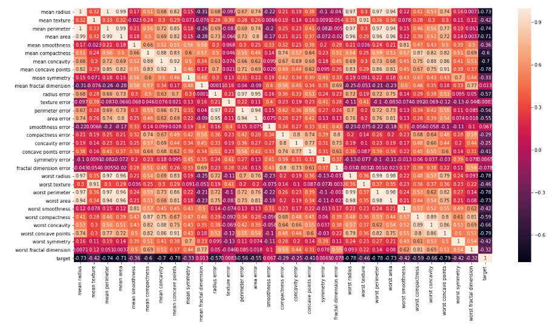

Next, I would need to train the model by creating a train data set and leaving the rest for the testing phase. I used the scikit learn library and imported the train_test split. I used 80% of the data to train the model and 20% for testing purposes.

Then I created a heat map through confusion matrix using the SVM model without any optimization. The model had clearly not classified the malignant tumors as seen from the picture and would need to be improved. 

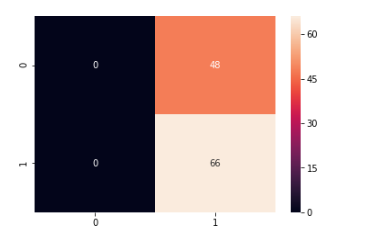

One of the ways to tackle this would be to first normalize the dataset. I used the Unity-Based normalization method to bring my value ranges between [0, 1]. Normalization would dramatically increasse the accuracy of the dataset. 

Next I used the SVM method and two paramaters to optimize the result. The first that I used was the C Parameter, which controls trade-off between training points by "penalizing" the dataset for misclassification. This can be visualized in the picture below:

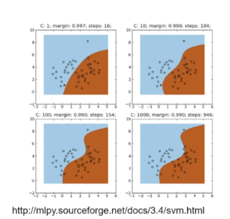

Here, we can see that with a small value of C the boundary lines are smooth as the cost of missclassification is low, but as the value of C increases the the boundary becomes defined because the cost of misclassification or the "penalty" is high.

For further, optimization I used the Gamma parameter. The Gamma parameter controls how far the influence of a single training set reaches. In other words it specifies the spread of a dataset. If we use a large gamma we will focus on the points closer to the hyper plane, or the line separating the malignant and benign dataset. We will disregard points further away, this is shown below.

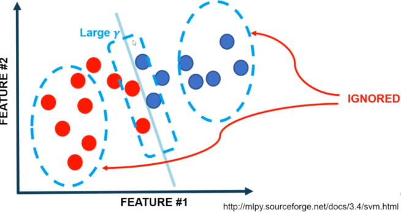

Below is the figure from small gamma, which is further reach and a more generalized solution.

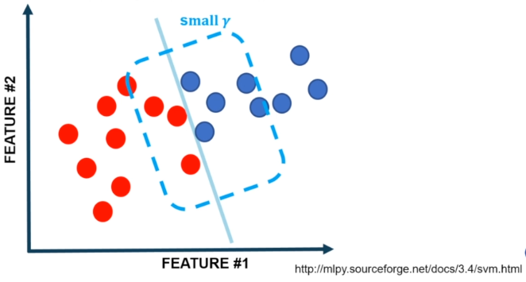

Now, I had decided the optimizations I would need to improve my data. First I normalized my data using the afore-mentioned Unity-Based normalization method. Below I noted the differences between the datasets after normilzation.
Here is the initial dataset:

Here is the normalized dataset:
Normalized Data.PNG

I used this normalized dataset to train my model again using SVC function. This had imrpoved my precision to dramatically to 96%. I visualized this in another heatmap through a confusion matrix. 

Here is the improved confusion matrix:
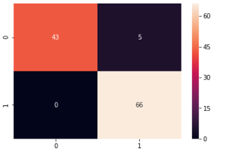

Next, I would use the SVM model and use both the C and Gamma Parameters. Now, I had to choose the best values for C and Gamma which would be difficult in a large dataset. I discovered a function in scikit learn called GridSearchCV which would help me search for the best paramaters given a grid. 

In this grid I set certain ranges for C and Gamma and chose a kernel of radial basis function. Now, I would use the grid to fit the normalized training data. Then I gained the best values by using the function grid.best_params_ which gave me a C value of 10 and gamma value of 0.1.

Finally, I used a function grid.Predict on my normalized data to get the optimized predictions. I plotted this in a heat map via a Confusion Matrix. 

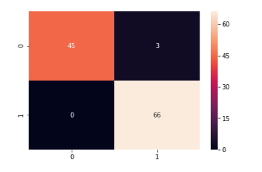

## Results

The way I was able to see my results was by plotting a classification report which would show my accuaracy. 

For the first non-optimized data I achieved a precision of 34%:

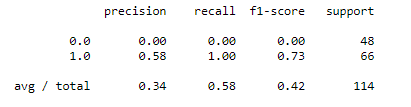

For the 2nd normalized data I achieved a precision of 96%:

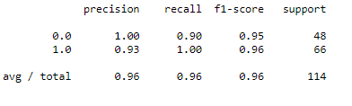

For the finali optimized data I achieved a precision of 97%:

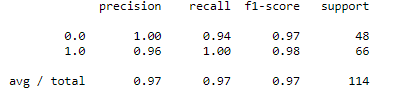

## Discussion

It's important to note that the missclassification in this case study was of a Type 1 Error. In other words, 3 tumors were classified as Malignant when they were Benign. There were no Type 2 Errors, which are far more dangerous. This would mean tumors would be classified as Benign while they are Malignant. This calssification technique can reduce workload for doctors and save lives, especially in the developing world. The technique can be further improved by combining Computer vision/ML techniques to directly classify cancer using the tissue image.

